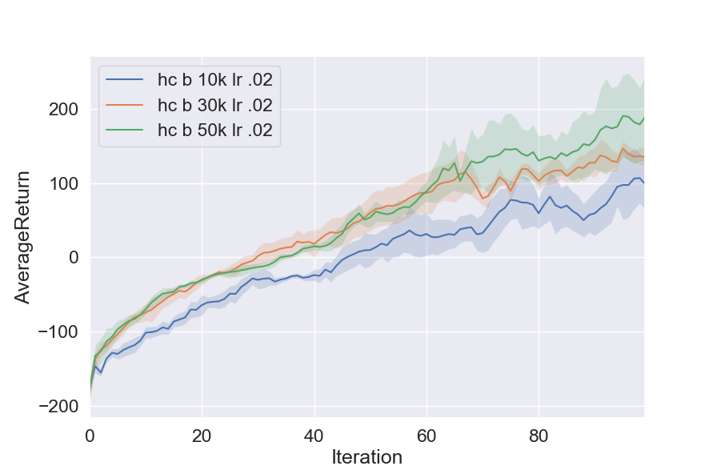

# Results
## Part 1 Derviations
Please see "Homework_2_p1.pdf".

## Cart Pole
### Large Batch

  

### Small Batch

  

## Inverted Pendulum
### Batch 1000, LR varied

  

LR = 0.01 was best

### Batch 2000, LR varied

  

LR = 0.01 was best

### Tiny batch, LR .02

  

Did this as a fun exercise to see how small the batch could go while still spiking to the score of 1000. This mainly demonstrates that having a good seed can lead to great results much faster (10x) than a bad one.

## Half Cheetah
### Batch 10k, LR varied

  

LR .02 was best

### Batch varied, LR .02

  

Batch 50000 was best

### RTG/NN Baseline Comparison

  

## Lunar Lander
This was a challenge. After getting the most recent version of Box2D to work, fixing an issue with the continuous log prob (one that the inverted pendulum did not pick up), setting gamma to .9999, and the actions properly clipped, the learning was still collapsing:

  

Supposing that the learning rate was too high, turning down the learning rate helped, but then the high score (180) wasn't reached by the end of the 100 iterations:

  

Trying again with same learning rate, but with a batch size of 50k, it's a little worse. (Thanks, cat, for terminating my experiment early, even though it was dying anyway. Just because it is made of warm doesn't mean it is meant for sits.)

  

